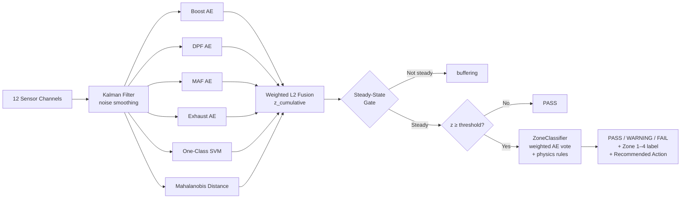

# LeakGuard Industrial — Diesel Engine Air Leak Detection & Isolation

> Real-time detection and zone-level isolation of air and exhaust leaks in CAT diesel
> engines during test cell development runs — using only the 12 sensor channels already
> present in a standard test cell.  No additional hardware required.

---

## Live Demo

| Service | URL |
|---|---|
| Frontend | https://diesel-engine-leak-detection.vercel.app |
| Backend API | https://leakguard-backend-3qj5.onrender.com |
| Streamlit Dashboard | https://dieselengineleakdetection-4tb2kahrv7kyggpbc6ctlc.streamlit.app |

**Demo login:** username `demo` / password `demo_password`

> The backend runs on Render's free tier. If it's been idle for 15+ minutes, 
> the first request takes 30-90 seconds to wake up — this is expected, not 
> a bug. The demo account is automatically re-seeded on every container 
> restart, so login always works regardless of uptime gaps.

**Demo credentials:** username `demo` / password `demo_password`

> **Note:** The Render free tier spins down after 15 minutes of inactivity. The first request takes 30–90 seconds to wake up — this is expected behaviour, not a bug. The demo account is automatically re-seeded on every container restart, so login always works regardless of uptime gaps.

---

## Problem

Diesel engines undergo extended dynamometer test runs before release. Air leaks in the
intake, charge-air, or exhaust path degrade performance, waste fuel, and can damage
downstream components. Finding them visually during a live test is difficult; stopping
a run to inspect adds hours of cost per engine.

The challenge: the 12 standard test-cell channels (rpm, boost, MAF, EGT, etc.) carry
overlapping signatures across leak types and engine operating points.  A charge-air leak
looks like an exhaust restriction at first glance; both look like normal warm-up transients
until the engine settles to steady state.

---

## Solution Architecture



---

## ML Pipeline

| Stage | Method | Why |
|-------|--------|-----|
| Preprocessing | Kalman filter (12 ch) | Optimal noise reduction for linear Gaussian sensor dynamics |
| Anomaly detection | 4 autoencoders (per-subsystem) | No leak labels needed at training time; learns healthy distribution |
| Multivariate check | One-Class SVM | Compact boundary in reconstructed feature space |
| Correlation check | Mahalanobis distance | Captures cross-sensor correlations single-sensor scores miss |
| Fusion | Weighted L2 norm: `√(z_boost² + z_dpf² + z_maf² + z_exhaust² + 0.3·z_mahal² + z_svm²)` | Per-model weights tuned on calibration data |
| Localisation | Weighted subsystem z-score voting + physics discriminators | Per-AE subsystem architecture makes zone attribution natural |

---

## Performance

Evaluated on 2,000 synthetic held-out samples (500/class, 5 seeds per class) at leak severity 0.40.
Window-level detection: ≥4/7 samples predicted anomalous → LEAK.

### Binary Detection

| Metric | Value |
|--------|-------|
| Precision | 1.000 |
| Recall | 1.000 |
| F1 | 1.000 |
| False Positive Rate | 0.000 |

### Zone Isolation

| Zone | F1 | Notes |
|------|----|-------|
| Zone 1 — Pre-compressor | 0.80 | Turbo-above-expected physics heuristic; seed-dependent (65–100%) |
| Zone 2 — Charge-air | 1.00 | Boost-below-expected discriminator gives clean isolation |
| Zone 3 — Exhaust path | 0.86 | Exhaust z-scores dominate; reliable isolation |
| Zone 4 — Test-cell ducting | N/A | Not simulated; requires real test-cell data |

**Macro F1 (zones 1–3): 0.884**

### Inference Latency

| Metric | Value |
|--------|-------|
| Mean per 7-sample window | 692 ms |
| p95 per 7-sample window | 807 ms |

> Scores reflect the synthetic simulator distribution used for training.
> Real test-cell validation is required before production deployment.
> See [`docs/MODEL_PERFORMANCE.md`](docs/MODEL_PERFORMANCE.md) for full report.

---

## Features

- **Real-time WebSocket inference** with threshold-based escalation cadence
  (PASS every 10 windows → WARNING every 3 → FAIL every window → `critical_alert`
  after 5 consecutive FAILs)
- **Zone isolation** localises leaks to 4 engine subsystem groups using physics
  mass-balance and pressure-ratio consistency checks
- **Batch CSV analysis** — upload a historical session file, receive a structured
  Go/No-Go report with zone breakdown and recommended inspection action
- **Streamlit monitoring dashboard** — live engine circuit diagram with CSS zone
  colour coding, z_cumulative trend, zone confidence bar chart, batch upload tab
- **On-premise** — all inference runs locally; no sensor data sent externally
- **Calibrated threshold** — single `ANOMALY_THRESHOLD` loaded from
  `engine_calibration.pkl` (mean + 3σ of healthy z-scores); shared by REST,
  WebSocket, and batch endpoints

---

## Quickstart

### With Docker (recommended — starts all three services)

```bash
git clone <repo-url>
cd DieselEngineLeakDetection
docker compose up --build
```

| Service | URL | Description |
|---------|-----|-------------|
| Backend (Django/Daphne) | http://localhost:8000 | REST API + WebSocket |
| Dashboard (Streamlit) | http://localhost:8501 | ML monitoring dashboard |
| Frontend (React) | http://localhost:5173 | Live monitoring UI |

### What you'll see

1. **Landing page** (`/`) — Product overview, feature cards, detection pipeline diagram, CTA to login
2. **Login page** (`/login`) — Operator authorization form with tab switch to register. Create an account then log in.
3. **Dashboard** (`/dashboard`) — Three-column layout:
   - **Left sidebar** — Engine model input, leak injection toggle (Charge / Exhaust / Pre-comp), START/STOP, EMERGENCY STOP
   - **Center** — Rolling z_cumulative anomaly chart, 6-sensor telemetry grid, event log with TSV export
   - **Right** — Zone confidence bars (gold highlight on detected zone), session info, zone key
4. Click **START** to begin a session. The status panel shows IDLE → buffering → PASS.
5. Toggle **Inject Leak Sim** and select a leak type. Within 2–3 windows (14–21 samples) the flag escalates to FAIL and the detected zone appears with a recommended inspection action.
6. The **Batch Analysis** button (sidebar) opens a drag-and-drop CSV upload → Go/No-Go report.

### Local development (alternative)

```bash
# TensorFlow is system-installed; venv must inherit it
python3.12 -m venv .venv --system-site-packages
source .venv/bin/activate
pip install -r requirements.txt

cp .env.example backend/diesel_engine_predictor/.env
# Edit .env: set DATABASE_URL=sqlite:///db.sqlite3

cd backend/diesel_engine_predictor
python manage.py migrate
daphne -p 8000 diesel_engine_predictor.asgi:application

# In another terminal (from project root):
streamlit run engine_simulator/app.py

# React frontend — Vite dev server with proxy:
cd frontend && npm install && npm run dev   # http://localhost:5173
```

---

## API Reference

| Method | URL | Auth | Purpose |
|--------|-----|------|---------|
| POST | `/user_auth/signup/` | No | Create user; returns `{"token": "..."}` |
| POST | `/user_auth/login/` | No | Authenticate; returns `{"token": "..."}` |
| POST | `/user_auth/logout/` | Token | Invalidate token |
| GET | `/user_auth/health/` | No | Docker healthcheck (`{"status": "ok"}`) |
| POST | `/api/predict` | Token | Single-shot inference on 12-channel sensor dict |
| POST | `/api/session/` | Token | Batch CSV → Go/No-Go session report |
| WS | `ws://host/ws/engine/` | Token | Real-time streaming inference |

Full protocol in [`docs/API_REFERENCE.md`](docs/API_REFERENCE.md).

---

## Running Tests

```bash
# From project root — uses pyproject.toml config
.venv/bin/python -m pytest tests/ -v -m "not slow"

# Include the slow batch-inference integration test
.venv/bin/python -m pytest tests/ -v

# Generate model performance report
.venv/bin/python scripts/generate_performance_report.py
```

---

## Project Structure

```
DieselEngineLeakDetection/
├── backend/diesel_engine_predictor/   Django project root
│   ├── predict/                        POST /api/predict + WebSocket consumer
│   ├── session_analysis/               POST /api/session/ + SessionReportGenerator
│   └── user_auth/                      Auth endpoints (signup/login/logout/health)
├── ml_model/
│   ├── data_gen/engine_simulator_core.py  Physics-based digital twin
│   ├── kalman/kalman_layer.py             12-channel Kalman filter
│   ├── steady_state.py                    CV-based transient gate
│   ├── zone_classifier.py                 Weighted AE vote + physics discriminators
│   └── models/model_stack.py             Singleton: all model artifacts + predict()
├── engine_simulator/app.py            Streamlit 4-tab monitoring dashboard
├── config/constants.py                All hardcoded values (thresholds, weights)
├── scripts/
│   ├── validate_zone_isolation.py     Zone discrimination table diagnostic
│   └── generate_performance_report.py Held-out eval → docs/MODEL_PERFORMANCE.md
├── frontend/                          Vite + React 18 frontend
│   ├── public/                        favicon.ico, icon-*.png, logo-*.png, manifest.json
│   ├── Dockerfile                     Multi-stage build: npm ci → vite build → serve
│   ├── .env.production                VITE_API_URL + VITE_WS_URL for Docker builds
│   └── src/
│       ├── pages/                     Landing.jsx · Login.jsx · Dashboard.jsx
│       ├── components/layout/         Header · Sidebar · Footer
│       ├── components/dashboard/      StatusPanel · AnomalyChart · ZoneConfidenceBars · SensorGrid · EventLog · BatchModal
│       ├── hooks/                     useAuth · useEngineWebSocket
│       ├── api/                       client · auth · session · websocket
│       └── lib/                       constants · sensorGenerator
├── tests/                             pytest suite (ML pipeline + API integration)
├── docs/                              Architecture, ML decisions, API reference
├── Dockerfile                         Backend ASGI image
├── Dockerfile.streamlit               Dashboard image
├── .dockerignore                      Excludes frontend/node_modules, .venv, __pycache__
└── docker-compose.yml                 backend + dashboard + frontend (all three services)
```

---

## Tech Stack

**Backend:** Python 3.12 · Django 6.0 · Django Channels · TensorFlow/Keras 3.14.1 · scikit-learn 1.7 · Streamlit · Plotly · pytest · Docker

**Frontend:** React 18 · Vite · Tailwind CSS 3 · React Router v6
